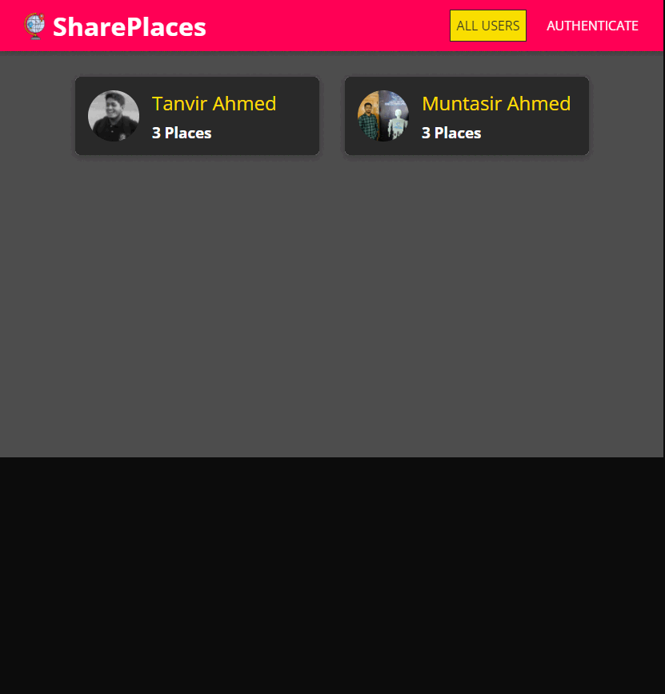

# SharePlaces🗺️

🚀 [Live Version](https://share-places-bd.netlify.app/ "SharePlaces"): https://share-places-bd.netlify.app/

---

📃 Description:

    SharePlaces is a platform where an user can share their travel experience about that place with others.

---

⚙️ Technologies:

    Frontend: HTML, CSS, JavaScript, React, Redux
    Backend: Node.js, ExpressJS
    Database: MongoDB
    Third-party API: Google MapAPI, MapBox API

---

📷 Screen Shots:

